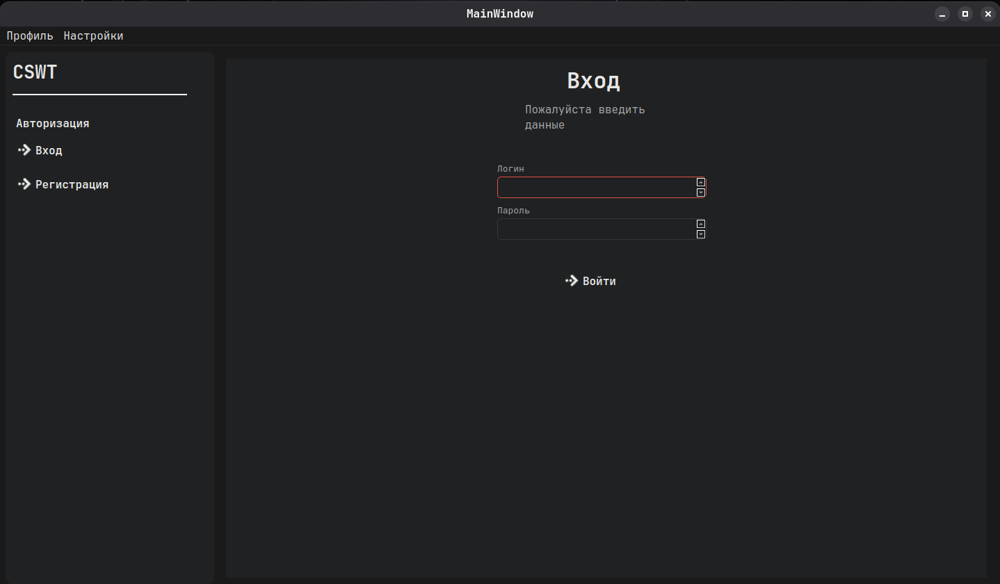
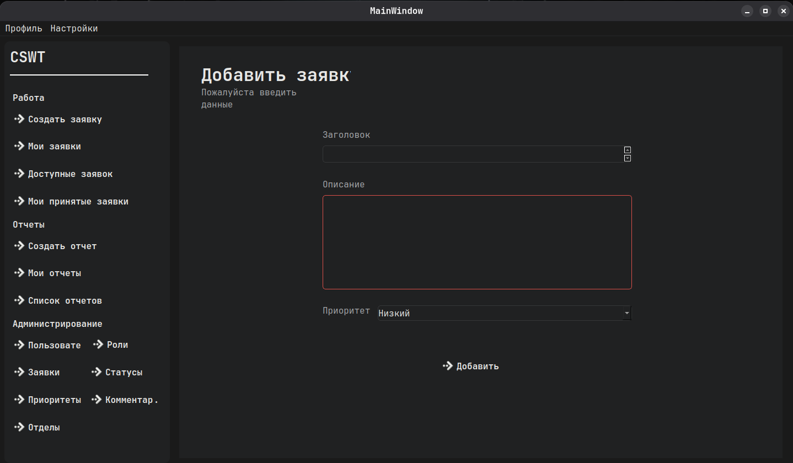
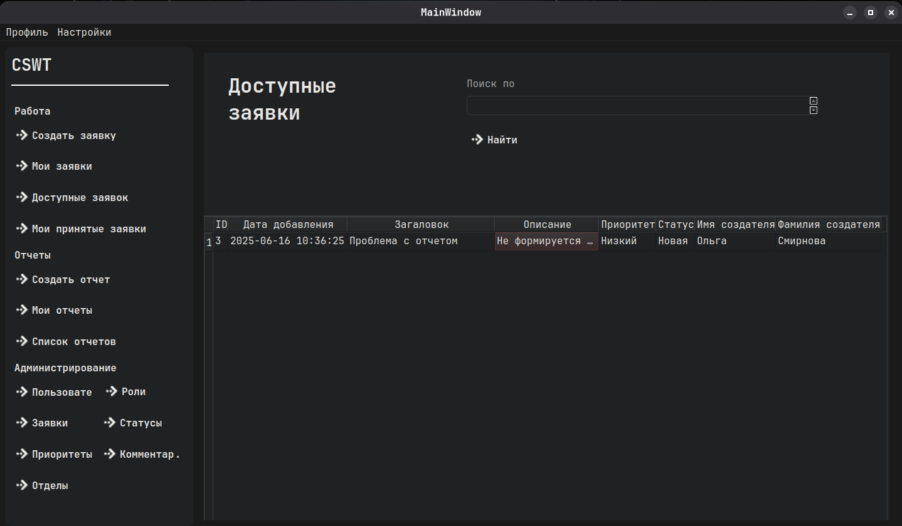
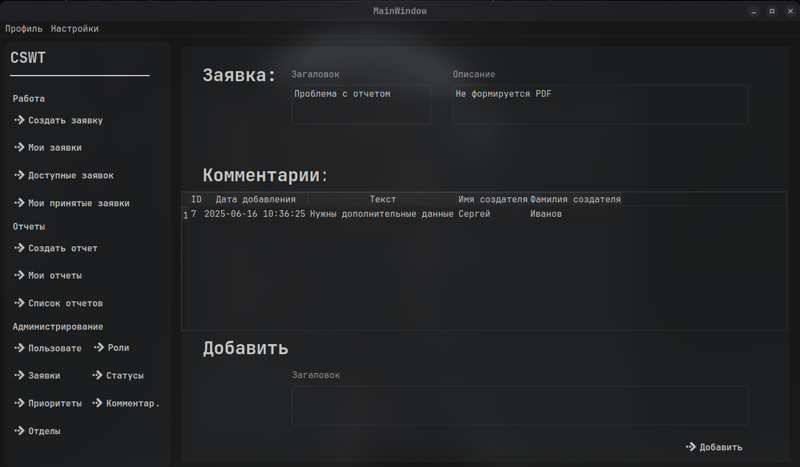

# Разработка ИС для учета работы отдела АСУ в ГБУЗ «Лабинская центральная районная больница» МЗ КК

##### Разработка не закончена, потому что приложения будет разрабатываться на языке C Sharp

## Описание проекта

Данный проект представляет собой разработку ИС для автоматизации учета работы отдела автоматизированных систем управления (АСУ) в ГБУЗ «Лабинская центральная районная больница» МЗ КК. Основная цель проекта — создание эффективной и надежной системы, которая позволит автоматизировать процессы учета, управления и анализа данных, связанных с деятельностью отдела АСУ.

## Технологии и инструменты

- **Язык программирования**: Python
- **Среда разработки**: VS Code
- **Система управления базами данных (СУБД)**: MySQL
- **Диаграммы и модели**: ER-диаграммы, UML

## Структура базы данных

База данных состоит из следующих таблиц:

1. **Users (Пользователи):**
2. **Roles (Роли):**
3. **Tickets (Заявки):**
4. **Statuses (Статусы заявок):**
5. **Priorities (Приоритеты заявок):**
6. **Comments (Комментарии к заявкам):**
7. **Departments (Отделы):**
8. **User_Departments (Связь пользователей с отделами):**
9. **Reports (Отчеты):**

## Картинки

## Не реализовано

- **Отчеты**: Не были реализована генерация отчетов!
- **Админ панели**: Не были реализованы админ панели нескольких сущностей!
- **Темы**: Не был реализован менеджер тем
